WebGL Forward+ and Clustered Deferred Shading
======================

**University of Pennsylvania, CIS 565: GPU Programming and Architecture, Project 5**

* Nick Moon
  * [LinkedIn](https://www.linkedin.com/in/nick-moon1/), [personal website](https://nicholasmoon.github.io/)
* Tested on: Windows 10, AMD Ryzen 9 5900HS @ 3.0GHz 32GB, NVIDIA RTX 3060 Laptop 6GB (Personal Laptop)
  * **Google Chrome Version 107.0.5304.88**


**This project is a WebGL implementation of two main rendering optimization techniques: Forward+ and Cluster
Deferred. Both of these optimizations aim to reduce the performance impact of shading a scene with many lights
(hundreds and thousands). Optimizations for the Cluster Deferred renderer also make the G-Buffer used
more compact, and thus more memory and performance efficient. Finally, both lambertian shading and GGX
microfacet shading are included as optional materials.**

## RESULTS

### Live Online

](http://TODO.github.io/Project5-WebGL-Forward-Plus-and-Clustered-Deferred)

### Demo Video/GIF


## IMPLEMENTATION

### Forward Rendering

Forward Rendering is the traditional style of rendering a scene in graphics APIs, or any rasterization pipeline
for that matter.
This involves the steps of sending vertices to the GPU, transforming them to be in projected camera space,
connecting them into triangles, rasterizing the triangles and interpolating vertex attributes, and finally
shading the pixels (or fragments) that make up each triangle and displaying those to the screen. While simple
to implement, there are a couple performance downsides with this approach. First, every fragment needs
to be shaded, which means that even objects obscured by geometry closer to the camera are shaded. This
adds a ton of additional overhead for scenes with many lights. Another issue is that each fragment
needs to compute the lighting received by each light in the scene, even for lights so far away that there
may be no significant impact on the final color. The approaches demonstrated in this project seek to
remedy these two performance bottlenecks.

### Clustering

Clustering is the process of dividing the view space frustum of the camera into slices in the x,y, and z
directions, and assigning lights to the clusters it overlaps with its given position and radius. In order
to do this, the bounding box of each light sphere is transformed into view space, and the . Note that
there are still a few bugs in my implementation, and I required help

### Forward+ Rendering

Forward+ rendering is a supplement of the traditional forward rendering. The pipeline is kept almost the same.
The only difference is now the clustered light index texture is used. In the fragment shader, the cluster x,
y, and z coordinates are generated much the same as how the sphere bounding box is transformed.

### Clustered Deferred Rendering

Clustered Deferred Rendering is a combination of two optimization techniques. The first is clustering, which
has already been described and is pretty much the same here. The second is that the rasterization and the
shading steps in the pipeline will be seperated out. What this means is first, the position, normal, and
albedo of the geometry will be generated via a normal shading pipeline that takes in geometry vertices
and transforms them to screen space. However, instead these position, normal, and albedo values will be 
stored in textures known as g-buffers, and no shading will be performed. Then, as a second pass, a quad will
be rendered to the screen. At each pixel of the rendered quad, the position, normal, and albedo g-buffers
will be sampled for the corresponding pixel from the the pre-pass, and those values will be used to shade
the geometry. What this means is that obscured geometry is no longer being shaded by all the lights in a
cluster, because now only the geometry that is directly visable to the camera (and stored into the texture during
the pre-pass) will be shaded.

### G-Buffer Optimizations

A naive approach to g-buffers is to store each group of information into its own texture. This certainly makes
debugging and displaying these g-buffer values easier, as can be seen below:

However, it turns out there is a lot of wasted space doing this approach. Below are three optimizations
I made to make my g-buffers more memory and performance efficient.

| Position   | Normal | Albedo |
| ----------- | ----------- |  ----------- |
| 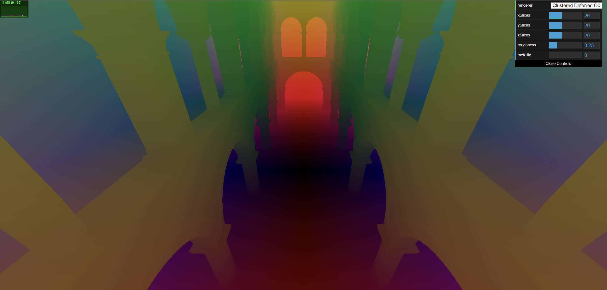      |        |  |

#### Efficient G-Buffer Packing

The most simplest optimization to make is to pack the g-buffer efficiently. In the naive implementation,
each pixel of the g-buffers was storing a vec4. However, attributes like position, normal, and albedo,
are all vec3 values. This meant that the last component in each pixel of these textures was unused.
By instead packing the attributes together, now it is the last three components of the third g-buffer that
are unused. While not making a performance impact with this specific instance, these are spaces that could 
be used for things like specular mapped attributes or emission mapped attributes, without using a new texture!

#### Octahedron Normal Encoding

The first serious optimization is to recognize that the normal value is, well, normalized. What this means is
that, given two values of the normal, x and y, the normal should simply be a value such that
the magnitude of all three equals one. So we should be able to solve for the z value with just the x and y values!
However, the direction of the z component cannot be exactly computed using this approach, as for each
x and y tuple there could be two z values that satisfy the normalized criteria, +z and -z. So, instead
the octahedron normal enconding method is used instead.

With this optimization, we reduce the number of g-buffers from 3 to 2!

#### Position Reconstructed from Depth

The final g-buffer optimization made was to reconstruct the world position from a depth value. This would
decrease the amount of data stored in the g-buffer for position from 3 (for x, y, and z) to 1 (for depth).
To do this, the technique from Matt Pettineo is used. First, the view space position of geometry is calculated
in the vertex shader of the rasterization pass. Then, in the fragment shader, the length of this position
is stored into the g-buffer as the depth. This is because the view space position is relative to the camera
at the origin, so the length is distance from the camera. Then, in the vertex shader of the shading pass,
the vertex positions of the quad (spanning from -1 to 1) are multiplied by the inverse view projection matrix.
This transforms the positions to world space, and then a ray is generated from the world space camera position
to these world space vertex positions. Finally, in the fragment shader of the pixel, the ray is normalized,
the depth is sampled from the g-buffer, and the ray is traversed from the camera in the ray direction
for depth amount. This is the reconstructed world position.

### Shading Models

Two different shading models were implemented:

#### Lambertian

The lambertian shading model is a simple shading model that scales the intensity of incoming light
by the angle between the surface normal and the incoming light direction. The light intensity in this
case also has a cubic gaussian falloff dictated by the scene parameter ```LIGHT_RADIUS```.

| Lambertian Radius 1.0   | Lambertian Radius 3.0 |
| ----------- | ----------- |
| 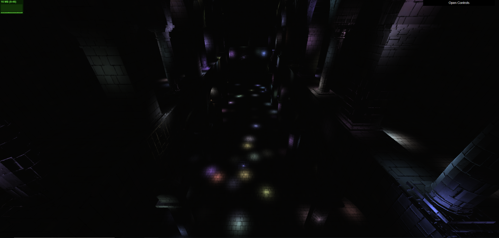      |        |

#### GGX

The GGX (or Torrance-Sparrow) shading model is a physically-based microfacet reflection model parameterized by a ```roughness```
and ```metallic```. The ```roughness``` value is between ```0.0``` and ```1.0``` and determines the
amount of light that is reflected by the surface based on the viewing angle and lighting angle. More
rough means closer to a lambertian surface, while less rough is more like a specular surface.
The ```metallic``` value is also between ```0.0``` and ```1.0```, and determines the amount of reflected
light that is based on a mixture of the material albedo and the light color. More metallic means that
less of the material albedo is reflected by the surface. At 1.0 metallic the light color is
perfectly reflected. Less metallic (also known as more plastic) means that more of the albedo is reflected
compared to the light color. At 0.0 metallic the surface reflects the material albedo, and any of the 
specular-like reflection created from a low roughness value will match the color of the material.

I specifically based this implementation on the version that is taught in Adam Mally's CIs 561 course.

| Plastic Rough   | Plastic Specular |
| ----------- | ----------- |
| 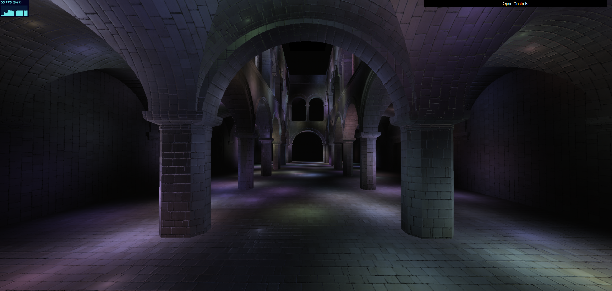      |   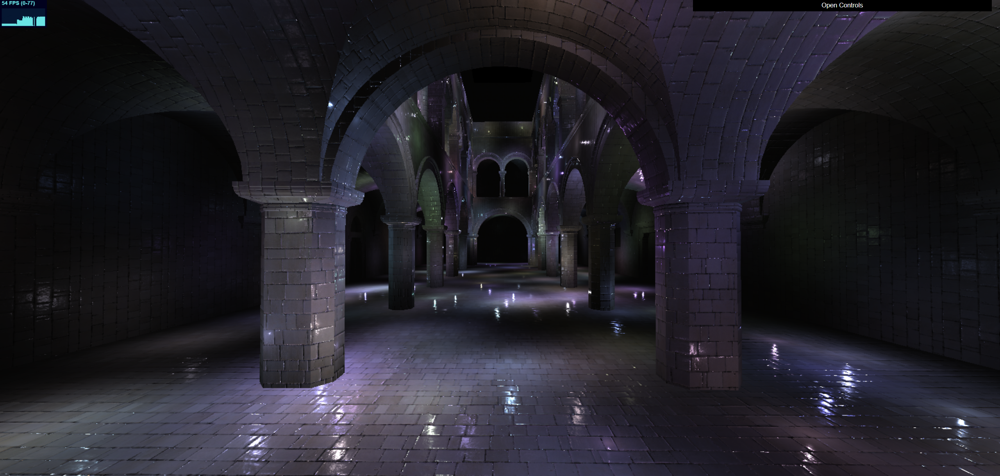     |

| Metal Rough   | Metal Specular |
| ----------- | ----------- |
| 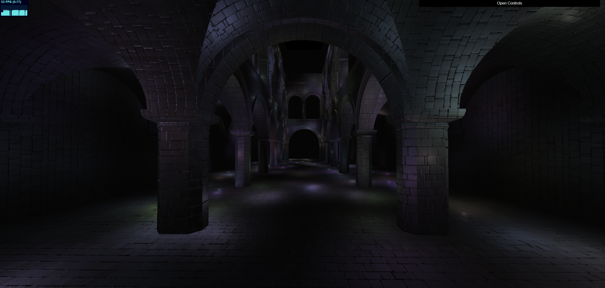      |   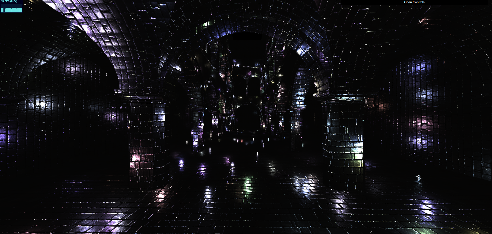     |

## PERFORMANCE ANALYSIS

### Number of Lights

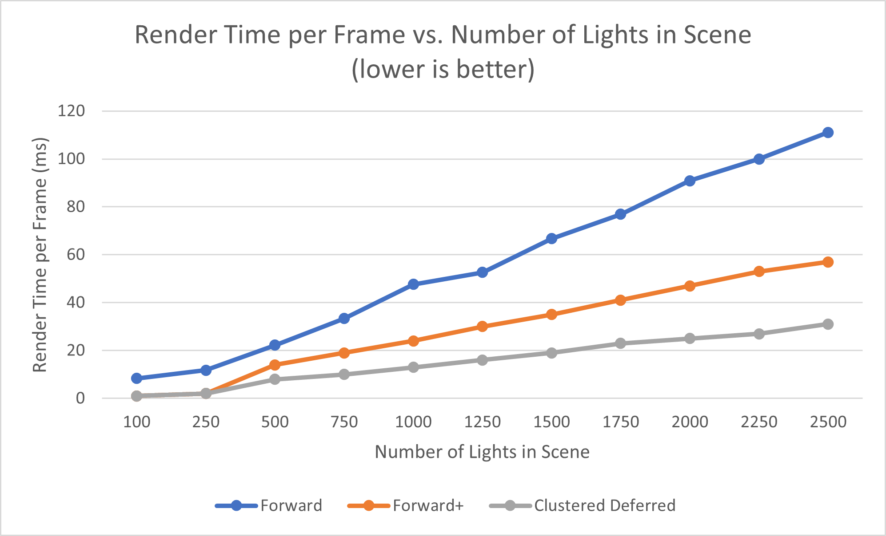

The graph above shows what was expected for these rendering types. As the number of lights in the scene
increases into the thousands, the performance gains from clustering increase, and the clustered deferred
was also faster than the forward plus because it is only shading (which is expensive with
many lights!) one fragment per pixel. These performance gains allow thousands of lights to be rendered
with real-time rates! Forward plus is also a bit better than clustered deferred for a smaller amount of lights,
due to the performance gains from only shading one fragment being less than the additional overhead of
a multistep rendering process with extra buffers.

### Light Radius

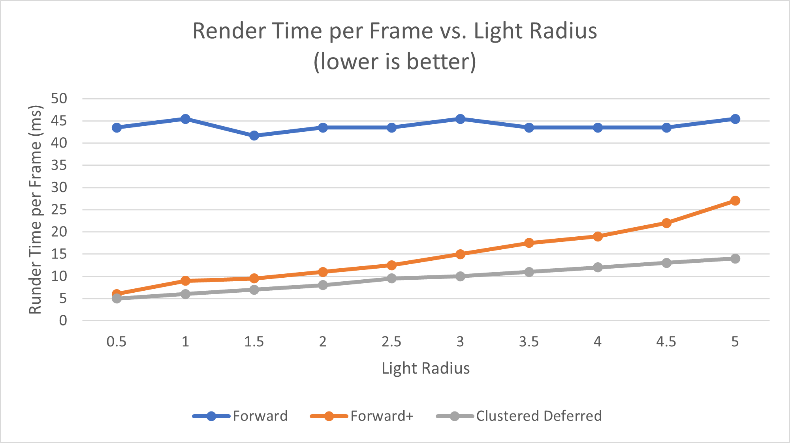

As the graph above shows, increasing the light radius causes the runtime of the clustered rendering modes
to get worse, approaching the plain forward renderer. This is because, as the radius of the lights increases,
the more of the overall clusters each one is included in. Taking to extremes, a high enough radius value will
cause every light to be in every cluster, and thus this will essentially be the non-clustered rendering,
albeit overhead from assigning these clusters. However, too low a radius will cause the contribution of
each light to be too small, and thus require more lights to properly light a scene, thus causing more
performance loss. Thus, the light radius parameter should be tuned according to a scene's needs, scale,
and overall performance.

Because forward rendering performance is not dependent on the light radius, changing light radius
makes no performance impact.

### Cluster Slices

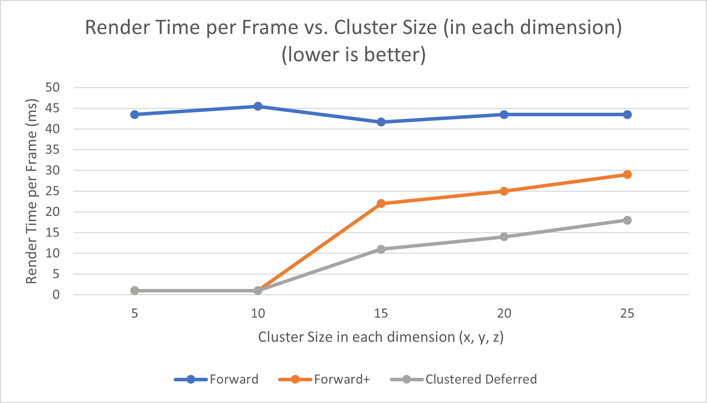

As can be seen in the graph above, increasing the number of cluster "slices" generally increases the runtime of
the clustered rendering modes. This is because the optimal slice values are highly dependant on the number
of lights in the scene. Too few lights and too many cluster slices will cause the program to become
cpu bound, as most of the effort will be spent on dividing a light into a series of clusters.
The performance for cluster slice numbers below 10 is a bit skewed, because a bug in the frustum code
causes not all the lights to be rendered at this low of cluster value. Theoretically, lowering the number
of clusters near 1 will cause the program to act more like the basic forward renderer, as a ton of lights
will be together in a cluster.


### Shading Model

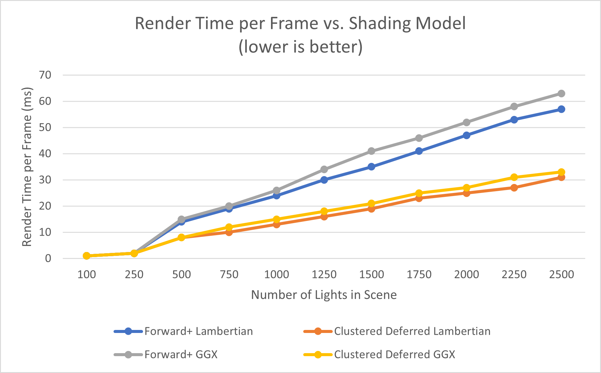

As can be seen from the figure above, the GGX shading model increased runtime by a pretty significant amount.
This is because there is quite a bit more math involved with this shading model as opposed to lambertian,
which is essentially just a dot product, with some additional overhead from the gaussian falloff. However,
the results are much more realistic, tunable, and are more extensible than plain lambertian shading.

### Optimizations

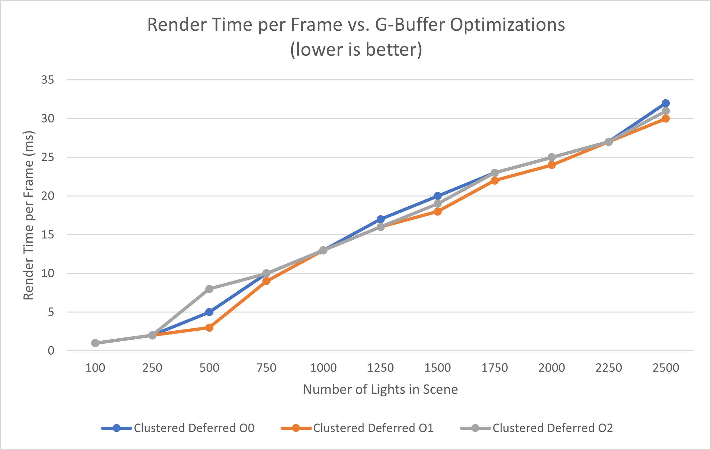

As can be seen from the figure above, adding optimizations to the deferred g-buffers made a slight impact on
performace. Overall, the difference is not large, especially as the number of lights is in the thousands.
This is because the impact is at most just one texture lookup, which is constant for the number of lights,
while an increase in the number lights means dramatically more increased texture lookups.


The O1 version appears best, because the optimization from the O2 version, storing only
depth instead of world position and recreating it in the shading pass fragment shader, did not decrease
the amount of g-buffers that was needed. So, while it did mean less component of the g-buffer were
needed (6 vs 8), the additional overhead of recreating the world position meant the O2 version was
slightly slower. In a circumstance where this change would make the g-buffer count decrease, this would
then have a justified performance impact. 

### Credits

* [Three.js](https://github.com/mrdoob/three.js) by [@mrdoob](https://github.com/mrdoob) and contributors
* [stats.js](https://github.com/mrdoob/stats.js) by [@mrdoob](https://github.com/mrdoob) and contributors
* [webgl-debug](https://github.com/KhronosGroup/WebGLDeveloperTools) by Khronos Group Inc.
* [glMatrix](https://github.com/toji/gl-matrix) by [@toji](https://github.com/toji) and contributors
* [minimal-gltf-loader](https://github.com/shrekshao/minimal-gltf-loader) by [@shrekshao](https://github.com/shrekshao)

* Adam Mally's CIS 561 Slides on Real-Time Microfacet Materials and Homework 7
* Zina H. Cigolle, Sam Donow, Daniel Evangelakos, Michael Mara, Morgan McGuire, and Quirin Meyer, Survey of Efficient Representations for Independent Unit Vectors, Journal of Computer Graphics Techniques (JCGT), vol. 3, no. 2, 1-30, 2014 (https://jcgt.org/published/0003/02/01/)
* POSITION FROM DEPTH 3: BACK IN THE HABIT by Matt Pettineo (https://mynameismjp.wordpress.com/2010/09/05/position-from-depth-3/)
