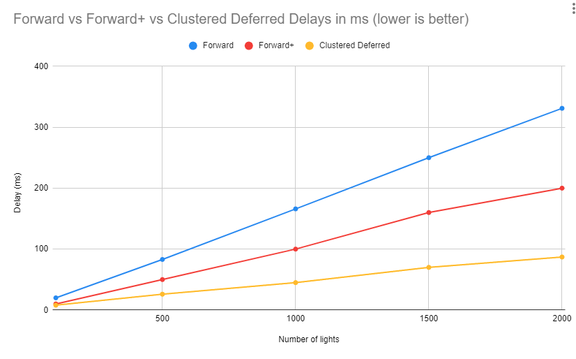
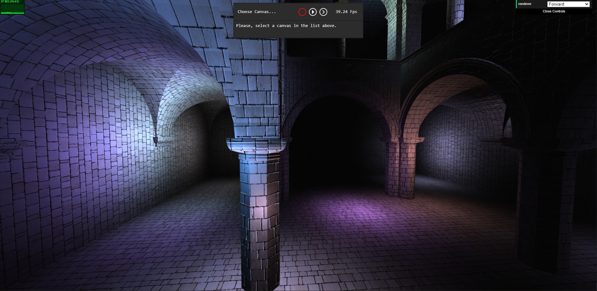
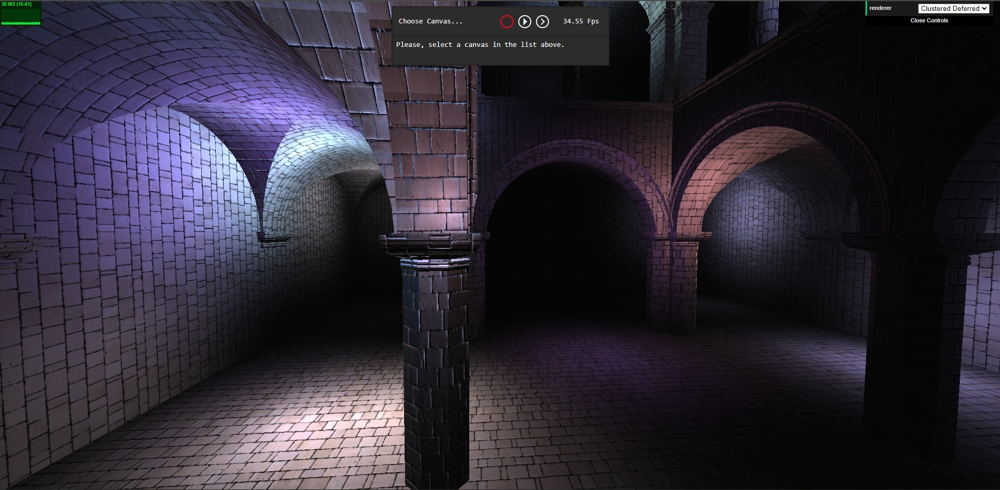

WebGL Forward+ and Clustered Deferred Shading
======================

**University of Pennsylvania, CIS 565: GPU Programming and Architecture, Project 5**

* Ryan Tong
* Tested on: **Google Chrome 160.0** on
  Windows 10, i7-8750H @ 2.20GHz 16GB, GeForce GTX 1060 6144MB (Personal Laptop)

### Live Online

### Demo Video/GIF

### Project Description
This project implements forward+ and clustered deferred rendering. Forward+ rendering optimizes a forward rendering pipeline by dividing the scene into frustums. The lights in the scene are treated as spheres and are then clustered into frustum buckets based on position. This allows the shader to only need to check the lights closeby that are within the frustum instead of looping through all lights which . Blinn-phong shading is also implemented. 

### Performance Analysis
The key advantage of the forward+ and clustered deferred pipeline is the optimization to only check relevant light sources. Therefore, performance gains are especially noticeable in scenes with a large number of lights. Clustered deferred rendering is also implemented. Clustered deferred rendering further improves the forward+ pipeline by decoupling the calculation of vertex attributes and shading. This is especially good for scenes with complex or large numbers of objects. Note that the max number of lights allowed in a cluster are increased each time to match the total number of lights. Below is a plot of delay based on the number of lights which shows these performance gains.

### Performance

From these results we can clearly see that clustered deferred is fastest, followed by forward+, then regular forward rendering. This is expected because clustered deferred builds on the optimizations in forward+. 

### Optimizations
Unfortunately, I did not have time to implement further optimization but instead provide some theoretical analysis. Specifically with GBuffers that each hold 4 floats to pass 3 vec3s (9 values). If we were able to condense one of the vec3s into 2 values, we would only have 8 values meaning we can save a Gbuffer. This would reduce the number of different global memory locations read meaning better performance. This could be reduced even further if the position vector is not passed and instead calculated using the camera and X/Y/depth. Although a comparison would need to be made to see if the computations outweigh the delay improvement.

###  Blinn-Phong Shading
I implemented blinn-phong shading to improve the visual quality of the render. This is a standard technique that has negligible impact. The results can be seen below.
### Regular

### Blinn-Phong

### Credits

* [Three.js](https://github.com/mrdoob/three.js) by [@mrdoob](https://github.com/mrdoob) and contributors
* [stats.js](https://github.com/mrdoob/stats.js) by [@mrdoob](https://github.com/mrdoob) and contributors
* [webgl-debug](https://github.com/KhronosGroup/WebGLDeveloperTools) by Khronos Group Inc.
* [glMatrix](https://github.com/toji/gl-matrix) by [@toji](https://github.com/toji) and contributors
* [minimal-gltf-loader](https://github.com/shrekshao/minimal-gltf-loader) by [@shrekshao](https://github.com/shrekshao)
