WebGL Forward+ and Clustered Deferred Shading
======================

**University of Pennsylvania, CIS 565: GPU Programming and Architecture, Project 5**

* Megan Reddy
  * [LinkedIn](https://www.linkedin.com/in/meganr25a949125/), [personal website](https://meganr28.github.io/)
* Tested on: Windows 10, AMD Ryzen 9 5900HS with Radeon Graphics @ 3301 MHz 16GB, NVIDIA GeForce RTX 3060 Laptop GPU 6GB (Personal Computer)
* Compute Capability: 8.6

### Live Online

### Demo Video/GIF

### Overview

In this project, we implement three methods for rendering a scene with a large number of point lights. The first method is **forward rendering**, which iterates through every light per fragment and calculates its contribution to the final pixel color. However, we know that not every light will contribute meaningfully to each fragment's color, so we instead implement an optimized version of this algorithm known as **forward+ rendering**. This algorithm first places lights in clusters and then only counts contributions from lights within a given cluster. The **clustered deferred rendering** algorithm further optimizes this by reading in values from a G-Buffer so that we are only shading visible fragments. 

### GUI Controls

* `renderer`     - which type of renderer you want to use (Forward, Forward+, Clustered Deferred, Clustered Deferred Optimized).
* `surfaceShader` - use Lambertian or Blinn-Phong shading.

### Implementation

#### Forward Rendering

The **forward rendering** algorithm is the slowest out of the three methods. For each fragment, it iterates through all lights in the scene, and does shading calculations for each one. For a scene with hundreds of lights, this can slow down performance a lot. This is because it spends time on shading occluded fragments and performing calculations for lights that do not contribute much to the object. 

#### Forward+ Rendering

The **Forward+** algorithm performs a pre-process step that splits the viewing frustum into clusters. Each cluster stores a `lightCount` and a list of light indices. The light indices represent the lights that influence the cluster. In the fragment shader, we **only** iterate through the lights in the cluster, not all of the lights in the scene. 

For a given scene, we specify a certain number of `slices` along each axis. The total number of clusters is determined by computing `xSlices * ySlices * zSlices`. A naive way of assigning lights to clusters involves iterating through each cluster, computing the sub-frustum, and then iterating through each light to check for overlap. We optimize this by iterating through each light, computing the range of cluster indices it overlaps, and then assigning that light to the appropriate cluster. A more detailed overview of the steps is provided below:

1. For a given light, compute its bounding box
2. Apply the view matrix to minimum and maximum of the bounding box
3. Compute the x, y, and z cluster ranges by projecting the bounding box coordinates into clip space
4. Iterate through each range and add the light to each cluster it overlaps

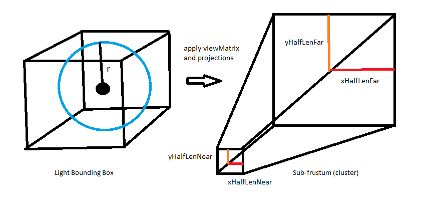

#### Clustered Deferred Rendering

The **Clustered Deferred** algorithm performs the same clustering pre-process as the **Forward+** algorithm. However, it also includes a separate pre-pass that stores values in a G-Buffer. We store **positions, normals, albedo** (pictured below). The benefit of doing this is that we only do lighting calculations for visible fragments. One downside is that we do increase memory bandwidth usage because we are repeatedly reading from the G-Buffer.

| Position        |  Normal  | Albedo
|:-------------------------:|:-------------------------:|:-------------------------:|
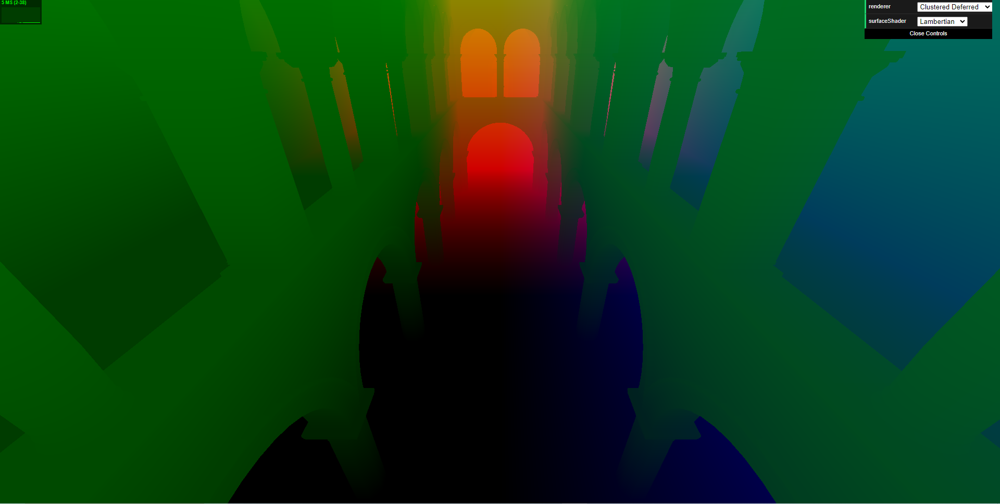  |  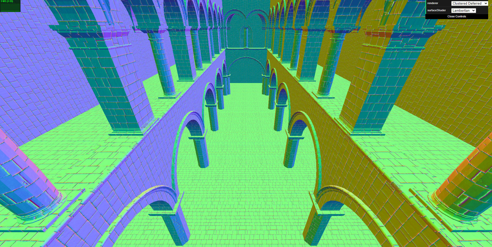 | 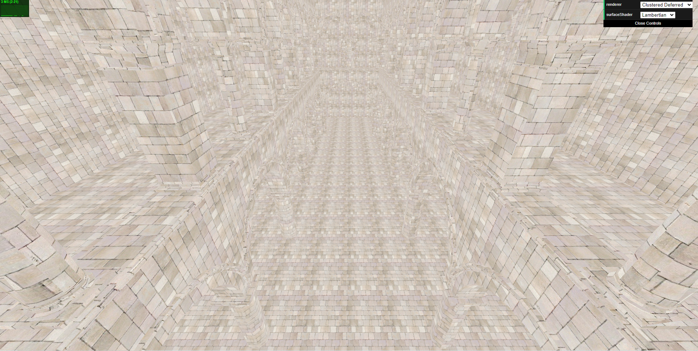

### Rendering Algorithm Performance

#### Methodology

For performance analysis, I disabled `DEBUG` mode and turned wireframe drawing off. I also had to switch the Graphics Settings on my computer to use my RTX card (it was using my AMD card before). I also made sure to close any other Chrome tabs to remove noise from the timings. 

Although the stats bar in the top left displayed ms/frame, this was not reliable for timing the **forward rendering** algorithm. It displayed the time as `0 ms` for some reason, even though the `FPS` counter showed the correct value. Therefore, I used the `FPS` value for timing and then converted this value to `ms/frame` later using `(1 / FPS) * 1000`. Although the `ms` counter was working for the other algorithms, I used the same methodology for all of them to ensure consistency. For the algorithms that had a working `ms` counter, I cross checked my calculated value with the displayed value to make sure my numbers were correct.

Unless otherwise noted, I used the following parameters for performance timings:

* Resolution: 1920 x 969
* Number of Lights: 1000
* Cluster Size: 15x15x15
* Surface Shader: Lambertian
* Light Radius: 5.0

#### Performance Comparisons

The graph below displays a general performance comparison between each rendering algorithm. We can see that the clustered deferred algorithms were faster than the forward and forward+ algorithms. This is expected since it is the most optimized out of the three.

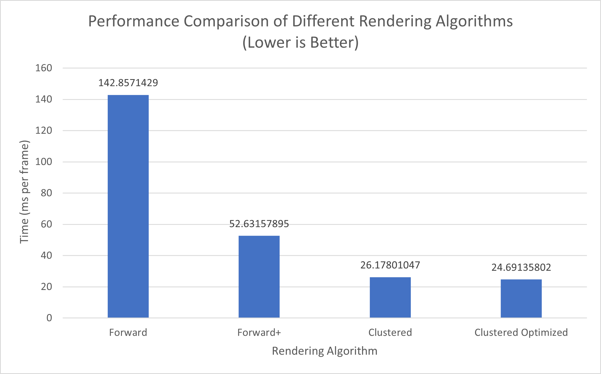

We can also vary different attributes, such as the number of lights, cluster size, and light radius. 

##### Number of Lights

As the number of lights increased, the performance decreased for all algorithms. This is expected because we have to perform calculations for more lights. In cases where there are a high number of lights, the forward+ and clustered deferred algorithms perform much better. This is because their clustering scheme ensures that we only perform calculations for lights that influence that fragment. In the forward algorithm, we check all lights which can become expensive for high light counts. We do notice that the forward algorithm performs well for a low light count (and high scene complexity). 

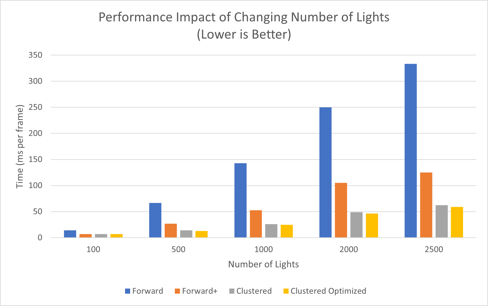

##### Cluster Size

Changing the cluster size also had a noticeable impact on performance. Although this graph indicates that a very small cluster size (5x5x5) is ideal, we will not use this value. Due to a bug in the cluster computation (see ***Known Issues and Bloopers*** section at the bottom), there are less lighting computations being done and therefore we see a performance speedup. The values for cluster sizes greater than and equal to 15x15x15, however, are more accurate. The expected outcome is that small cluster sizes will lead to slow performance due to overhead from light culling. Big cluster sizes will have slow performance due to having many overlapping lights. In the graph, we can see this trend for the clustered algorithms. The 10x10x10 cluster size is slightly slower than 15x15x15. The time increases for cluster sizes greater than 15x15x15. Therefore, we conclude that 15x15x15 is the optimal cluster size. 

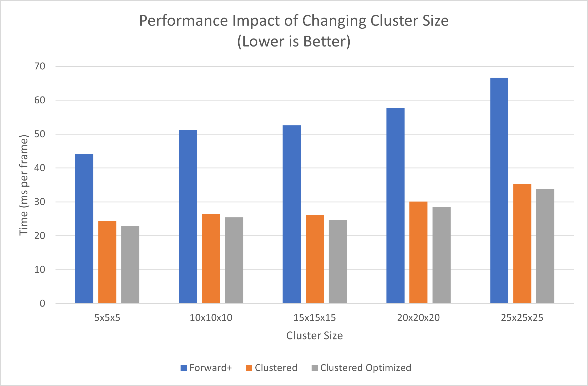

##### Light Radius

Lastly, increasing the light radius slows down performance. The forward algorithm stayed at a constant value since it was already lagging at `light_radius = 1.0` and only got slower as
the radius increased. This is also due to the number of lights being 1000. As light radius increases, the number of clusters it overlaps is greater. Therefore, we will have more lights within a cluster. This leads to an increase in lighting calculations, which will slow down performance.  

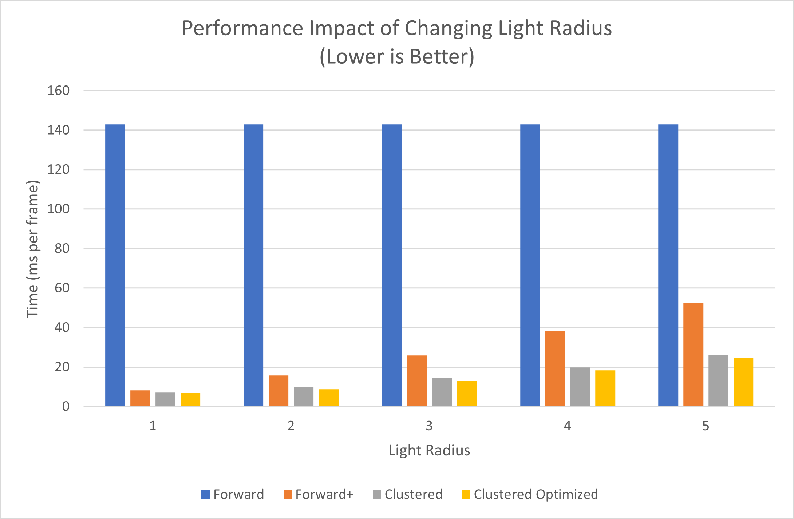

### Effects and Optimizations

#### Blinn-Phong Shading

*Blinn-Phong shading in a scene with 500 lights*

The Blinn-Phong shading model is a modified version of the Phong shading model. It computes a **halfway vector** to determine the specular contribution. This vector lies exactly halfway between the view and light direction. When the halfway vector is closer to the surface normal (determined by `dot(halfway, normal)`), the stronger the specular contribution. We can change the value of the specular exponent to change the sharpness of the highlight.

| Specular Exponent: 8.0       |  Specular Exponent: 25.0 
|:-------------------------:|:-------------------------:
  |  

A performance comparison of the Lambertian vs. Blinn-Phong shading is provided below for each rendering algorithm. The following settings were used to record this data:

* Resolution: 1920 x 969
* Number of Lights: 1000
* Cluster Size: 15x15x15
* Light Radius: 5.0
* Specular Exponent: 16.0

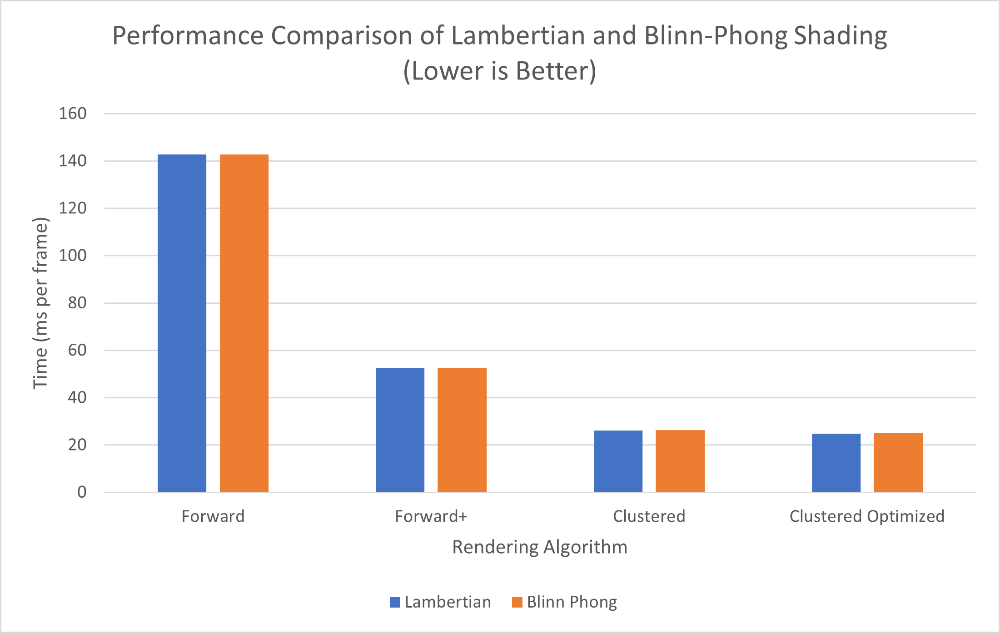

There is a slight performance decrease with the Blinn-Phong shading, which is more noticeable for the Clustered and Clustered Optimized algorithms. One reason behind this is that there is more computation required for Blinn-Phong shading; it not only requires computing the diffuse lighting term, but also the specular term. For the deferred shading algorithms, the specular exponent also has to be read from the G-Buffer, which could also slow down the computation slightly. 

#### G-Buffer Optimizations

There are three G-Buffer optimizations we performed for this project:

* Packing values together into vec4s (see G-Buffer layout below)
* Using 2-component normals (reference: [oct-encoding normals](https://jcgt.org/published/0003/02/01/))
* Reconstructing world space position using camera matrices and x/y/depth (reference: [position from depth](https://mynameismjp.wordpress.com/2010/09/05/position-from-depth-3/))

For a basic pipeline, I was able to fit all necessary values into 3 G-Buffers. After optimization, I only used 2 G-Buffers. My G-Buffer layout is as follows:

| G-Buffer #     |      0      |  1 |  2 |  3 |
|:----------:       |:-------------:           |:------:|:------:|:------:|
| 0             |  depth | normal.x | normal.y | specExponent |
| 1           |  color.x | color.y | color.z | unused |

For two-component normals, I followed the method described in the paper "Survey of Efficient Representations for Independent Unit Vectors." Essentially, the normal is "encoded" by projecting it onto an octahedron and then projecting it onto a unit square. For reconstructing position from depth, I first computed the depth by taking the length of the view position (`pos - cameraPos`). Then, I constructed a view ray and computed the point along the ray using this depth value. 

There was some performance benefit to adding these optimizations, which are described for different scenarios (changing lights, cluster size, light radius) in the section above. I have reproduced one of the graphs here to examine it further. 

* Resolution: 1920 x 969
* Cluster Size: 15x15x15
* Surface Shader: Lambertian
* Light Radius: 5.0

We can see that there was slight performance improvement using the optimized G-Buffer. By reducing the number of G-Buffers, we reduced the memory bandwidth usage. When compared to the other algorithms (see graphs above), we notice that the optimized clustered deferred gives the best performance results in scenes with a large number of lights. In scenes with a small number of lights, the performance results are comparable to those of unoptimized clustered deferred and forward+. There are some slight visual differences when using the optimized g-buffer, most noticeably with the oct-encoding of the normals. We noticed that some of the small details, such as the lines between the bricks, are less pronounced when using the compacted normals. 

| Unoptimized      |  Optimized
|:-------------------------:|:-------------------------:
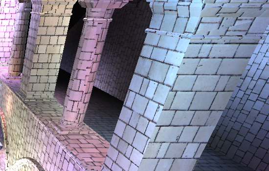  |  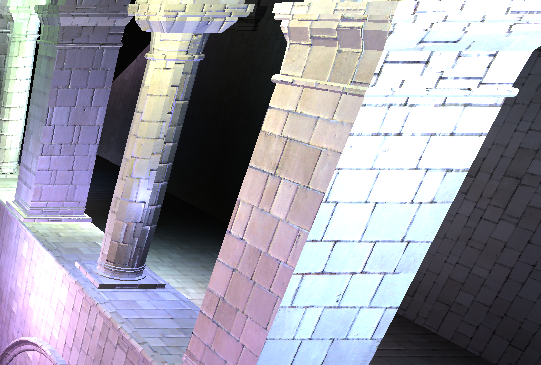

### Known Issues and Bloopers

One issue I encountered was these tiling artifacts on the screen when I computed a fragment's cluster index based on the `gl_FragCoord` variable. I left this implementation commented out in my forward+ and deferred fragment shader files. I am not quite sure if this is a GPU or CPU side issue, so I was not able to find a fix for this. I did notice, however, that adding a padding value to the light radius (e.g. `lightRadius + 5.0`) did erase some of these artifacts.

I ended up changing the way I computed the cluster index. I instead passed in the viewMatrix and reconstructed the `clusterX`, `clusterY`, and `clusterZ` the same way I did in the `updateClusters` function. While this fixed the artifacts in the top image, it created another issue where a certain number of clusters at the back of the image are rendered black (bottom image). I believe this could be an error in the transformation sequence, where the frame of reference of the coordinates is not quite right. Increasing the cluster size does mitigate this error a bit. 

<em>Tiling artifacts on the right side of the screen. </em>

<em>Black pixels in the back of the image. These are clusters with no assigned lights. </em>

### Credits

* [Survey of Efficient Representations for Independent Unit Vectors](https://jcgt.org/published/0003/02/01/)
* [Reconstructing Position from Depth](https://mynameismjp.wordpress.com/2010/09/05/position-from-depth-3/)
* [Blinn-Phong Shading](https://en.wikipedia.org/wiki/Blinn%E2%80%93Phong_reflection_model)
* [Three.js](https://github.com/mrdoob/three.js) by [@mrdoob](https://github.com/mrdoob) and contributors
* [stats.js](https://github.com/mrdoob/stats.js) by [@mrdoob](https://github.com/mrdoob) and contributors
* [webgl-debug](https://github.com/KhronosGroup/WebGLDeveloperTools) by Khronos Group Inc.
* [glMatrix](https://github.com/toji/gl-matrix) by [@toji](https://github.com/toji) and contributors
* [minimal-gltf-loader](https://github.com/shrekshao/minimal-gltf-loader) by [@shrekshao](https://github.com/shrekshao)
