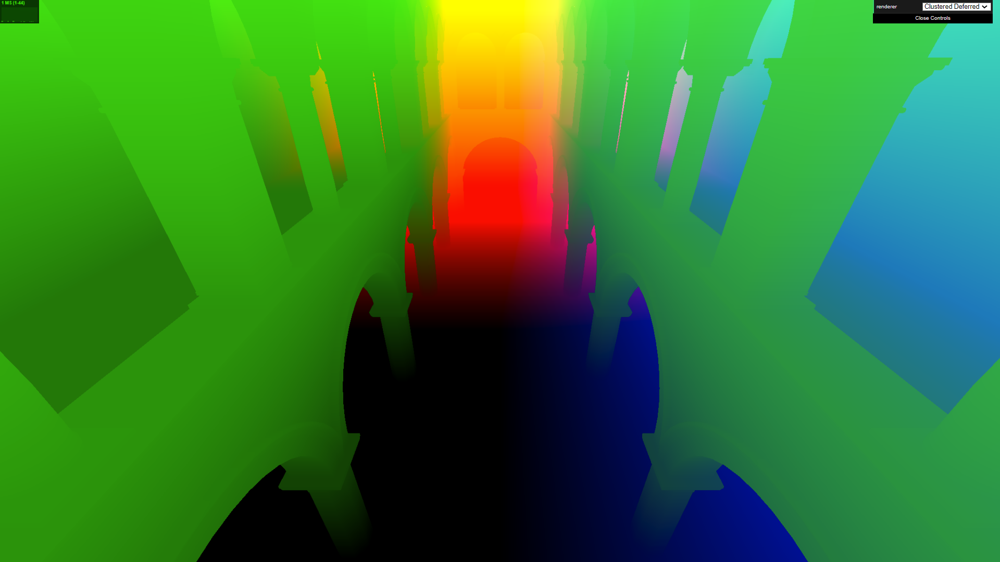
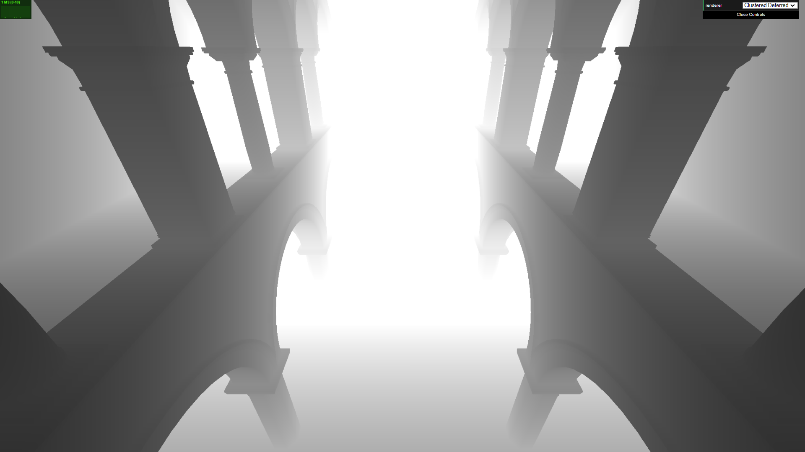

WebGL Forward+ and Clustered Deferred Shading
======================

**University of Pennsylvania, CIS 565: GPU Programming and Architecture, Project 5**

Constance Wang
  * [LinkedIn](https://www.linkedin.com/in/conswang/)

Tested on AORUS 15P XD laptop with specs:  
- Windows 11 22000.856  
- 11th Gen Intel(R) Core(TM) i7-11800H @ 2.30GHz 2.30 GHz  
- NVIDIA GeForce RTX 3070 Laptop GPU

This project implements two optimized rendering methods for scenes with a large number of lights: 1) Forward+ rendering which uses clustering to optimize the search for lights that contribute a noticeable effect to each pixel and 2) Clustered Deferred rendering which implements the clustering method from Forward+ in a deferred shader. These two methods are compared to forward rendering as a baseline.

Additional features:
- Bloom filter using two post-process passes
- G-buffer optimizations: reconstruct position from depth and pack values into vec4

### Live Online
[https://conswang.github.io/Project5-WebGL-Forward-Plus-and-Clustered-Deferred/](https://conswang.github.io/Project5-WebGL-Forward-Plus-and-Clustered-Deferred/)

Note: had to use 'copy-webpack-plugin' to copy the entire models folder into the build folder, as webpack can't really detect files referenced by gltf files.

### Demo
  
[full video here](images/sponza-bloom.mp4)

### Performance
In each of these tests, forward+ and deferred used cluster dimensions of 15 x 15 x 15, with the cluster depth ranging from 0.1 to 300. The scene is `sponza.gltf` with coloured lights generated randomly around the scene. 

.png)

.png)

Overall, the performance of clustered deferred > forward+ >> forward rendering. This makes sense, since forward+'s optimization makes the most expensive step of lighting calculations (iterating through all the lights) less expensive by culling many lights outside the pixel's cluster. Clustered deferred rendering takes advantage of this optimization, and on top of that, reduces the total number of these still-expensive calculations needed from one per fragment to one per pixel.

However, forward+ rendering does better than clustered deferred for tiny lights (radius = 1 or 2) and/or smaller number of lights (< 100). The number of fragments affected by the lights would be relatively small in these cases, so the performance gain from deferred shading does not outweigh the overhead of computing two render passes.

On the other hand, the performance of forward rendering becomes intolerable pretty quickly as the number of lights increases. However, since the calculations are independent of radius, forward rendering's frame rate is constant no matter how much we increase the radius, making it a reasonable option if all the lights take up a large portion of the screen.

Memory consumption: in theory, clustered deferred > forward+ > forward. Forward rendering doesn't require any extra buffers. Forward+ requires a cluster buffer and light buffer. Clustered deferred requires both buffers, as well as per-pixel g-buffers. However, in practice I found the memory usage difference not to be very significant, with forward rendering at 45 MB of allocated memory, and clustered sometimes at 50, sometimes at 60 MB.

### Bloom Filter
I added a bloom filter effect to the clustered deferred shader - set `SHOW_BLOOM` in `clusteredDeferred.js` to toggle the feature. After the deferred render pass, we write to two render targets: the rendered texture, and a "bright" texture which only contains pixels above a certain brightness threshold. The bright texture is then Gaussian blurred in a second fragment shader and added to the rendered texture to create an effect of light bleeding through edges.

| Bright texture | Gaussian blur | 
| --- | ----|
  |  | 

| Render texture | Final result |
| --- | ----|
| |  | 

At 100 lights of radius 5, adding the Bloom filter slows down the frame rate from 58 fps to 35 fps. This makes sense due to the addition of two post-process passes which run in parallel. 

The runtime of Bloom itself is not affected much by the number of lights or light radii, since the post-processing passes work the same way regardless of variables. Allocated memory increases from 50-60 MB to around 60-70 MB, which makes sense due to the additional textures.

Possible enhancements:
- replacing Gaussian blur with A-trous to have a larger kernel for cheaper (would need to measure to see if Gaussian is slow enough for this to be worth it).
- visual improvements: Bloom would look more realistic with high definition rendering, would have to change the colour texture format to implement this

### G-Buffer Optimizations
My unoptimized clustered deferred renderer uses 3 g-buffers containing albedo, normals, and positions as vec4s in separate textures.

I optimized the g-buffers by replacing the position buffer with a single depth value, and using the camera's inverse view matrix to reconstruct the position from depth.  Set `G_BUFFER_NO_POSITION` to true to enable this. I also packed the depth as the fourth component of the albedo g-buffer, reducing the total number of g-buffers to 2.

Debug views:
| Position (divided by 10) | Depth (divided by 10) |
|---|---|
|  |  |

| Normals | Albedo |
|---|--|
| |  |

The performance gain was more noticeable around 100-300 lights with radius of 5. It may be that with more lights, the compute time of processing the clusters was the more significant factor.

Further improvements: I calculated the position by adding depth * forward vector to the camera position, then adjusting for the xy pixel offset using the left and up vectors. It might be faster to calculate camera position + view vector * distance, I saw some methods [here](https://mynameismjp.wordpress.com/2010/09/05/position-from-depth-3/). We could also try sampling the hardware depth buffer and adjust the calculations accordingly, saving more g-buffer space.

### Oops
c o l o u r   s y n t h (wrong position buffer)  

[and many more here (´。＿。｀)](https://docs.google.com/document/d/1BJmclri4VJY_IXbsLU8Er_CQihQnfmzTQRi5cz9FthM/edit#heading=h.xsr527b9gzdk)

### Credits

* [Three.js](https://github.com/mrdoob/three.js) by [@mrdoob](https://github.com/mrdoob) and contributors
* [stats.js](https://github.com/mrdoob/stats.js) by [@mrdoob](https://github.com/mrdoob) and contributors
* [webgl-debug](https://github.com/KhronosGroup/WebGLDeveloperTools) by Khronos Group Inc.
* [glMatrix](https://github.com/toji/gl-matrix) by [@toji](https://github.com/toji) and contributors
* [minimal-gltf-loader](https://github.com/shrekshao/minimal-gltf-loader) by [@shrekshao](https://github.com/shrekshao)
