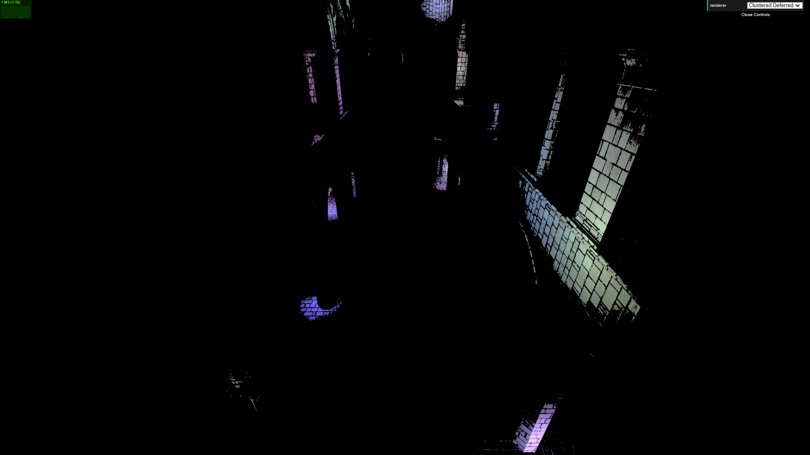
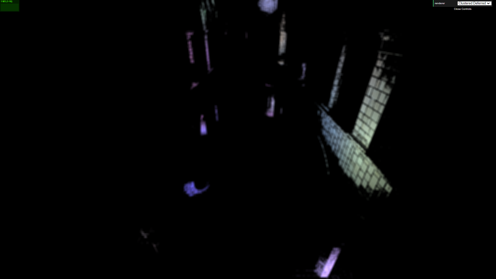
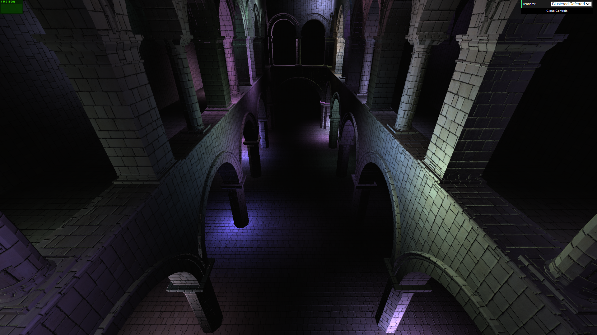
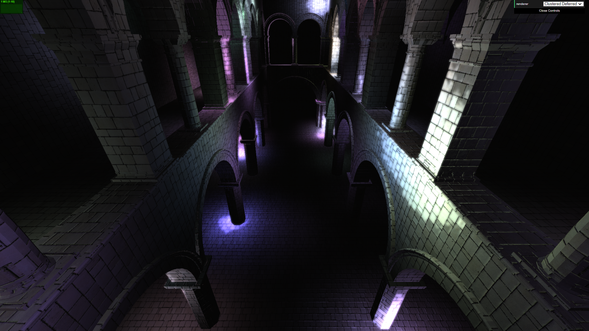

WebGL Forward+ and Clustered Deferred Shading
======================

**University of Pennsylvania, CIS 565: GPU Programming and Architecture, Project 5**

Constance Wang
  * [LinkedIn](https://www.linkedin.com/in/conswang/)

Tested on AORUS 15P XD laptop with specs:  
- Windows 11 22000.856  
- 11th Gen Intel(R) Core(TM) i7-11800H @ 2.30GHz 2.30 GHz  
- NVIDIA GeForce RTX 3070 Laptop GPU

This project implements two optimized rendering methods for scenes with a large number of lights: 1) Forward+ rendering which uses clustering to optimize the search for lights that contribute a noticeable effect to each pixel and 2) Clustered Deferred rendering which implements the clustering method from Forward+ in a deferred shader. The first optimization makes the lighting calculations less expensive, and the second optimization reduces the number of lighting calculations needed down to 1 per pixel.

Additional features:
- Bloom filter using two post-process passes
- G-buffer optimizations: reconstruct position from depth and pack values into vec4

### Live Online
[https://conswang.github.io/Project5-WebGL-Forward-Plus-and-Clustered-Deferred/](https://conswang.github.io/Project5-WebGL-Forward-Plus-and-Clustered-Deferred/)

Note: had to use 'copy-webpack-plugin' to copy the entire models folder into the build folder, as webpack can't really detect files referenced by gltf files.

### Demo
  
[full video here](images/sponza-bloom.mp4)

### Performance
Todo

### Bloom Filter
I added a bloom filter effect to the clustered deferred shader - set `SHOW_BLOOM` in `clusteredDeferred.js` to toggle the feature. After the deferred render pass, we write to two render targets: the rendered texture, and a "bright" texture which only contains pixels above a certain brightness threshold. The bright texture is then Gaussian blurred in a second fragment shader and added to the rendered texture to create an effect of light bleeding through edges.

| Bright texture | Gaussian blur | 
| --- | ----|
  |  | 

| Render texture | Final result |
| --- | ----|
| |  | 

### G-Buffer Optimizations
Todo

### Oops
c o l o u r   s y n t h (wrong position buffer)  

[and many more here (´。＿。｀)](https://docs.google.com/document/d/1BJmclri4VJY_IXbsLU8Er_CQihQnfmzTQRi5cz9FthM/edit#heading=h.xsr527b9gzdk)

### Credits

* [Three.js](https://github.com/mrdoob/three.js) by [@mrdoob](https://github.com/mrdoob) and contributors
* [stats.js](https://github.com/mrdoob/stats.js) by [@mrdoob](https://github.com/mrdoob) and contributors
* [webgl-debug](https://github.com/KhronosGroup/WebGLDeveloperTools) by Khronos Group Inc.
* [glMatrix](https://github.com/toji/gl-matrix) by [@toji](https://github.com/toji) and contributors
* [minimal-gltf-loader](https://github.com/shrekshao/minimal-gltf-loader) by [@shrekshao](https://github.com/shrekshao)
